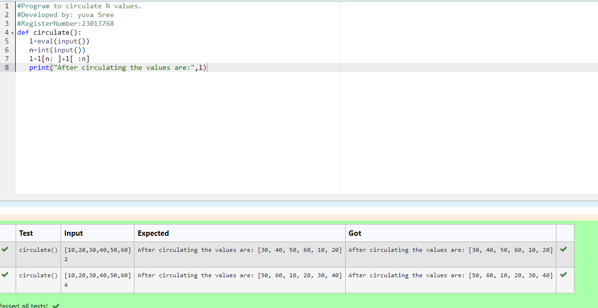

# Circulate-the-values-of-N-variables
## Aim:
To write a python program to circulate the n variables using function concept
## Equipment’s required:
PC
Anaconda - Python 3.7
## Algorithm: 
### Step 1: Get the values from the user
### Step 2: Get the input
### Step 3: Get the value from the user for the number of rotation
### Step 4: Using the slicing concept rotate the list
### Step 5: Print the values it would be interchanged
### Step 6: End the program
## Program:
```
#Program to Circulate N Values 
#Developed by:Yuva Sree M
#RegisterNumber:23013768
def circulate():
   l=eval(input())
   n=int(input())
   l=l[n: ]+l[ :n]
   print("After circulating the values are:",l)
```
## Output:


## Result:
Completed